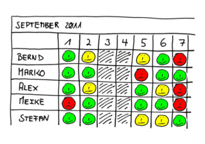

# CodeRoom
iot experiments

# Raspian

- Latest Jessie Light : https://downloads.raspberrypi.org/raspbian_lite_latest
- default login/pass : pi/raspberry
- Minibian : https://minibianpi.wordpress.com/features
- expand filsystem : `sudo resize2fs /dev/mmcblk0p2`

:warning: add a `ssh` empty file to the /boot partition to enable headless boot and SSH server

:warning: add a `wpa_supplicant.conf` file to the /boot partition to enable WiFi
 
# JavaScript

- johnny-five : http://johnny-five.io/
- raspi-io pin infos : https://github.com/nebrius/raspi-io/wiki/Pin-Information
- NodeJS home automation framework https://pimatic.org/

# Niko-niko

## On l'appelle également...

Le terme "feeling board" est également utilisé. C'est un radiateur d'information.

Le terme est d'origine japonaise, le redoublement indiquant un effet d'onomatopée, "niko" signifie "sourire".

## Origines

proposé par Akinori Sakata dans [cet article](http://www.geocities.jp/nikonikocalendar/index_en.html) début 2006

## Bénéfices

L'intérêt de la pratique est d'objectiver un élément, la motivation ou le bien-être de l'équipe, habituellement subjectif et difficile à mesurer.

C'est une excellente illustration du "Principe de Gilb": "Si vous avez besoin de quantifier quelque chose, il existe toujours une manière de le faire qui soit préférable à ne pas le quantifier du tout." En d'autres termes, il n'est pas nécessaire qu'une mesure soit parfaite ou très précise, dès lors que votre objectif est de rendre quantifiable quelque chose qui ne l'est pas encore: l'essentiel est de commencer.

## Plus

[Niko-niko](http://emmanuelchenu.blogspot.com/2009/02/niko-niko.html), d'Emmanuel Chenu (2009)

## Mood Meter

[Mood Meter](http://moodmeterapp.com/science/)

## TP 

