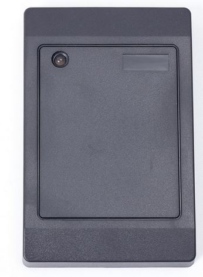
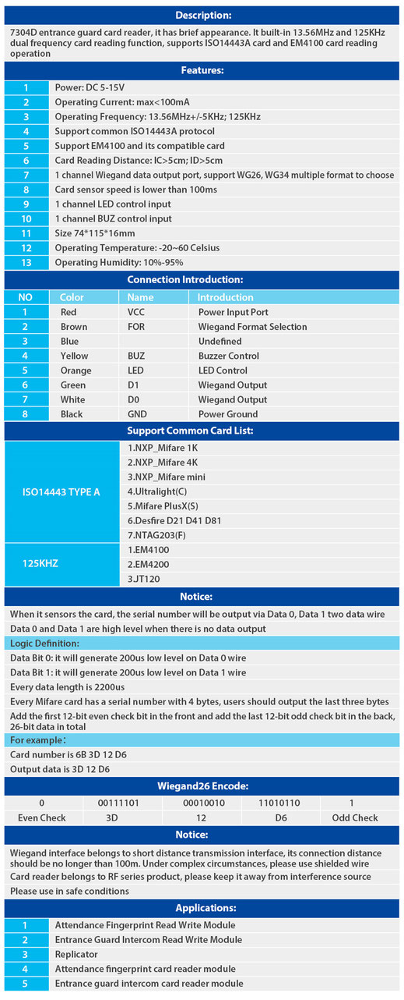

# Lecteur RFID 7304D2

Ce lecteur RFID se présente comme un boitier de lecteur de badge, et selon les spécifications techniques, il est compatible arduino et permet la lecteur de plusieurs fréquences.

Sa simplicité d'utilisation est le principal argument.

il ne nécessite que 2 entrées digital.

 

prix : 9,26 euros. 

# Fiche technique

Source: https://smartpoker.jimdo.com/lecteur-rfid-7304d2/
